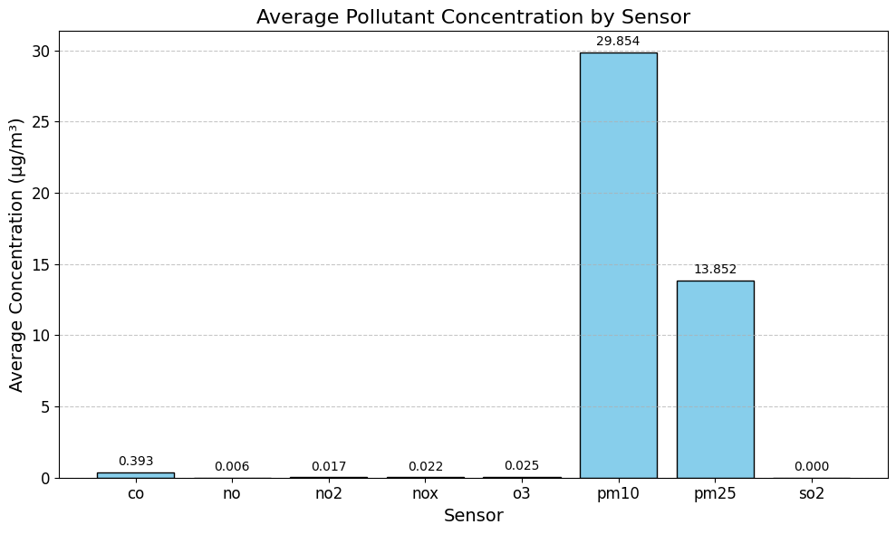
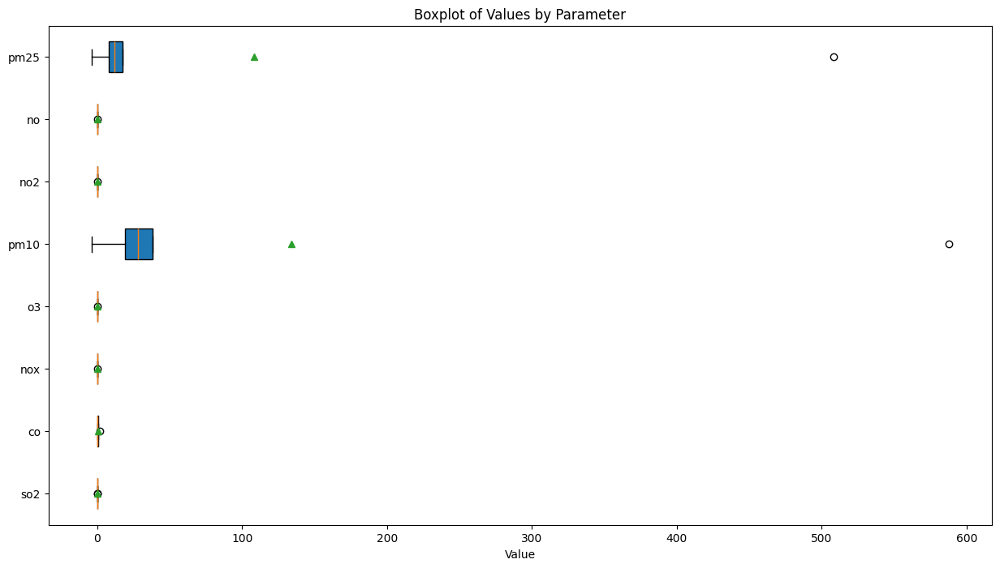
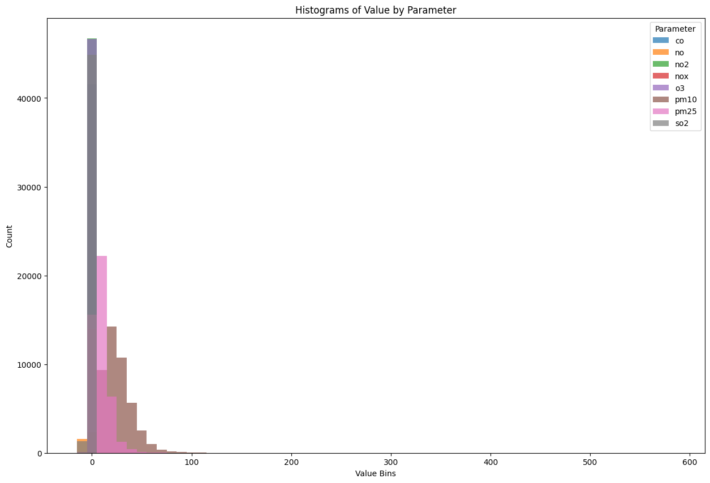
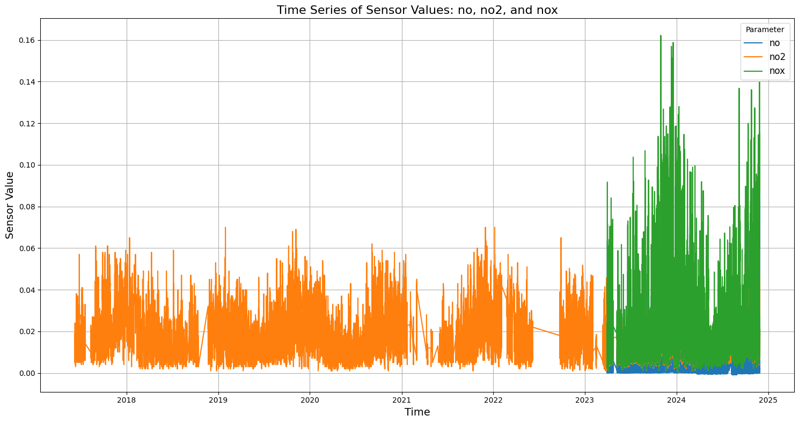
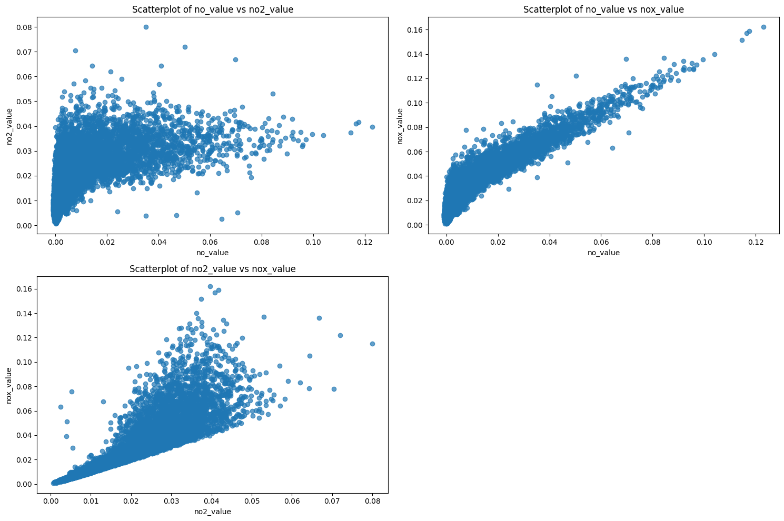
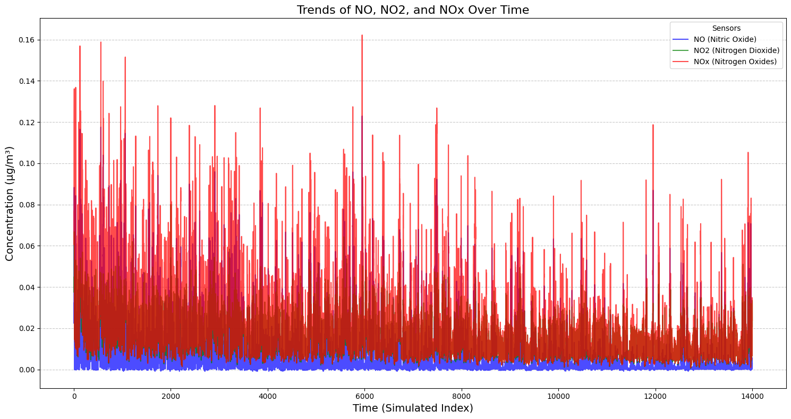

# **Eliminating NO (Nitric Oxide) Air Quality Sensor for Project Cost Optimization**

---

## Overview
This project analyzes **air quality monitoring sensor data** to identify cost-optimization opportunities. Specifically, I assess the redundancy of the **`no` (Nitric Oxide) sensor** and determine if its removal would maintain data integrity while reducing costs.

---

## Objective
My goal is to evaluate whether the **`no` sensor can be eliminated** without losing crucial data. This is achieved through **statistical correlation analysis** and **linear regression modeling**, using **`no`, `no₂` (Nitrogen Dioxide), and `noₓ` (Nitrogen Oxides) sensor data**.

---

## Hypothesis
Eliminating the `no` sensor (Nitric Oxide) in N. Mai, Los Angeles California (CA), will have a minimal impact on overall air quality monitoring. This is based on the strong correlation, interdependence, or redundancy of `no` with other related pollutants, such as `no2` and `nox`. By leveraging data from these sensors, it can effectively derive `no` levels, thereby optimally reducing project expenses while maintaining the integrity of air quality data.

---

## Methodology
1. Data Preparation  
2. Descriptive Statistics Analysis  
3. Scatter Plot Analysis  
4. Correlation Analysis  
5. Line Plot & Time Trends  
6. Linear Regression Modeling  

---

## Descriptive Statistics

| Parameter | Count | Mean | Std Dev | Min | 25th Percentile | Median | 75th Percentile | Max |
|----------|--------|------------------------|-------------------------|--------|------------------|---------|------------------|------------------------|
| so2      | 46,170 | 2.1603e-4              | 4.0413e-4               | -0.001 | 0.0              | 0.0     | 2.0e-4           | 0.01                   |
| co       | 41,529 | 0.3931                 | 0.2528                  | 0.0    | 0.2              | 0.3     | 0.5              | 2.0                    |
| nox      | 14,004 | 0.0221                 | 0.0206                  | 8.0e-4 | 0.0079           | 0.0144  | 0.0288           | 0.1622                 |
| o3       | 46,634 | 0.0250                 | 0.0184                  | 0.0    | 0.008            | 0.025   | 0.038            | 0.138                  |
| pm10     | 46,675 | 29.8535                | 16.2686                 | -4.0   | 19.0             | 28.0    | 38.0             | 588.0                  |
| no2      | 46,689 | 0.0175                 | 0.0113                  | 6.0e-4 | 0.008            | 0.0147  | 0.025            | 0.08                   |
| no       | 14,008 | 0.0065                 | 0.0125                  | -9.0e-4| 3.0e-4           | 0.0013  | 0.006            | 0.1229                 |
| pm25     | 46,089 | 13.8518                | 9.2207                  | -3.8   | 8.0              | 12.0    | 17.4             | 508.0                  |

---

## Sensor Analysis & Observations

- The **`no` sensor** only has **14,008** data points, which is significantly fewer than others.
- The average value of `no` is very low, suggesting a minor environmental impact.
- `no` has similar patterns to `no2` and `nox`, indicating redundancy.

---

### 📈 Average Pollutant Concentration

- `no` (Nitric Oxide) - one of the lowest average concentration, suggests that it might have less effect on the environment.
- `no2` (Nitrogen Dioxide) - Linked to combustion or burning processes (like automobiles, industries), higher concentration than ‘no’.
- `nox` (Nitrogen Oxides) - total of no and no2, it has a larger value than ‘no’ but is still very low overall.

---

### 📊 Boxplot Value Distribution

---

### 📉 Histogram Distribution of Sensor Values

- Each bar's height indicates the count.
- Majority of measurements for `no` cluster is just a small percentage in the range. 

---

### 📈 Time Series Line Plot

- Between 2022 and 2023, there is a noticeable gap for every metric, a sign of missing data or sensor failure.
- `nox` has seen a significant increase in results following 2023, indicating either changes to the environment, mistakes in measurement, or adjustments to the data collection process.
- Possibly related to environmental cycles like temperature or human activity, `no2` shows consistent seasonal or periodic behavior.
- Changes in the real world, including increased industrial activity, traffic, or changing seasons in pollutant concentrations, may be the cause of the `no2` moves and the `nox` increase.
- Data gap can be sensors were not working or when problem gathering the data.
- Correlations - the patterns in `no2` and `nox` may be connected.

---

### 🔍 Sensor Correlation Scatter Plots

- [1] `no` vs `no2`
   - There is some correlation between `no` and `no2`, according to the data points. Little disorganized connection.
   - Not entirely dependent on one another.

- [2] `no` vs. `nox`
   - Tight rising trend, strong positive correlation between `no` and `nox`.
   - ‘nox’ is sum of `no` and `no2`, this implies that ‘no’ levels significantly contribute to `nox` levels.

- [3] `no2` vs. `nox`
   - `no2` and `nox` have a high positive correlation, just like [2].
   - This shows how `no2` and `nox` are interdependent. Changes in `no2` result in `nox`.

---

### 📈 Seasonal & Time Trends

---

## Predictive Modeling & Redundancy Justification

- A **linear regression model** was built using `no2` and `nox` to predict `no`.
- The model's results show that `no` values can be **precisely predicted** from the other two variables.

### Model Result
- **R²:** `0.9998760560412906`  
- **RMSE:** `0.00013389460874487974`  
- **Coefficients:** `[-1.0005, 1.0027]`  
- **Intercept:** `-2.6839e-05`

These metrics strongly indicate that the `no` sensor adds **no unique value**.

---

## Conclusion

✅ Eliminating the **`no` sensor** does **not impact air quality monitoring performance**.  
✅ The regression model can accurately estimate `no` using `no2` and `nox`.  
✅ This results in **cost savings** for maintenance, hardware, or calibration.  
✅ The approach demonstrates the power of **correlation analysis** and **predictive modeling** in sensor optimization.

---

## Files and Reports
- 📄 **[Project Selection Hypothesis](project-selection-hypothesis.pdf)**  
- 📄 **[Methodology Report](methodology.pdf)**  
- 📄 **[Results & Discussion](results-and-discussion)**  
- 📊 **[Project Cost Optimization Notebook](project-cost-optimization.pdf)**  

---

## References
- Davda, K. (2024, June 27). What is low-cost air quality monitoring, and what are its Working principles? Oizom. https://oizom.com/what-is-low-cost-air-quality-monitoring/
- DD-Scientific. (n.d.). GS+7NO Nitric Oxide (NO) Sensor | Industrial specification. https://ddscientific.com/products/gs-7no-electrochemical-sensor-nitric-oxide-no
- Great Basin Unified Air Pollution Control District (n.d.). Low-Cost Air Quality Sensors. https://www.gbuapcd.org/AirMonitoringData/LowCostSensors/
- Kang, Y., Aye, L., Ngo, T. D., & Zhou, J. (2021). Performance evaluation of low-cost air quality sensors: A review. The Science of the Total Environment, 818, 151769–151769. https://doi.org/10.1016/j.scitotenv.2021.151769
- Kunak Technologies S.L. (2023, June 30). The power of low-cost air quality sensors for cleaner environments. Kunak. https://kunakair.com/low-cost-air-quality-sensors/
- OpenAQ Location ID 7936. (n.d.). OpenAQ Explorer. https://explore.openaq.org/locations/7936
- World Meteorological Organization. (2024, June 13). Low-cost sensors can improve air quality monitoring and people’s health. https://wmo.int/media/news/low-cost-sensors-can-improve-air-quality-monitoring-and-peoples-health
